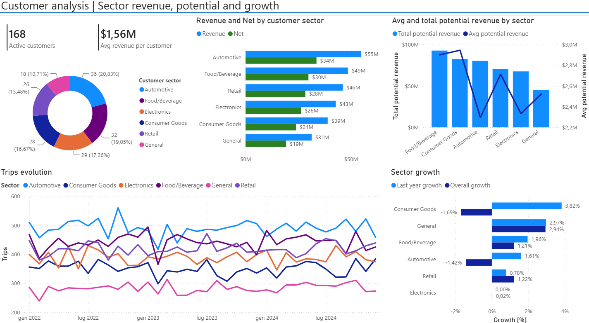
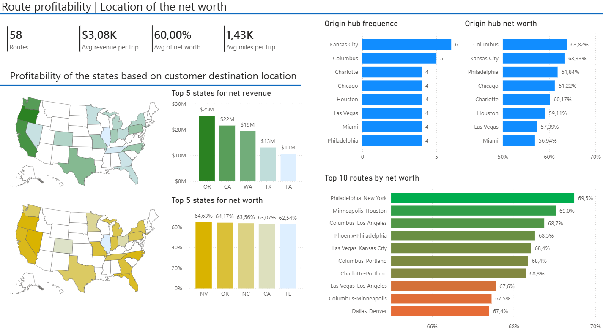

# Logistic-company-analysis

description

## Executive summary

## Key findings
### Financial Performance
- Revenue remained stable at approximately $88M annually.
- Total operating costs decreased from $36M in 2022 to $32M in 2024.
- Net revenue increased from $52M to $56M over the period.
 
### Operational Performance
- More than 85,000 trips were completed.
- Fleet efficiency remained stable around 6.5 MPG.
- Safety incidents remained below 60 events per year.
 
### Customer Analysis
- The top five customers generated a significant share of total revenue.
 
### Seasonality
- Revenue shows recurring seasonal patterns.
- February consistently appears below average while summer months show stronger performance.

## Customer's analysis

## Key findings
### Sector Performance
Automotive generated the highest revenue over the analyzed period, exceeding $55M.

### Customer Mix
The customer base is well diversified across six major sectors, with no sector representing an excessive concentration risk.

### Growth
Consumer Goods showed the strongest recent growth, while Automotive experienced a slight contraction during the last year.

### Operational Trends
Trip volumes remained stable across the three-year period, suggesting consistent demand.

## Route Profitability

## Key findings
### Route Profitability
 - The most profitable transportation lanes achieved profit margins close to 70%, indicating a highly efficient pricing and cost structure on selected routes.
 - Profitability among the top-performing routes is relatively homogeneous, suggesting that the company's route network is optimized and does not rely on a single exceptionally profitable lane.
 - Several routes generate similar profit margins despite different geographic destinations, highlighting opportunities to replicate successful operational practices across the network.

### Geographic Performance
 - Oregon, California, Washington, Texas and Pennsylvania represent the largest contributors to net revenue, making them strategically important markets for the business.
 - High-revenue states do not always coincide with the states exhibiting the highest profit margins, confirming that revenue alone is not a sufficient indicator of route performance.
 - States such as Nevada, Oregon and North Carolina show some of the strongest margins, suggesting favorable operating costs and/or pricing conditions.

### Hub Efficiency
 - Kansas City is the most frequently used origin hub, indicating its central role within the transportation network.
 - Although not the busiest location, Columbus ranks among the hubs with the strongest profitability performance, demonstrating that operational efficiency can outweigh pure shipment volume.
 - The comparison between hub frequency and hub profitability highlights potential opportunities to redirect volumes toward more profitable network nodes.

### Business Recommendations
 - Increase commercial focus on high-margin routes to maximize profitability while maintaining service quality.
Investigate the operational practices of top-performing hubs and replicate them across lower-margin locations.
 - Evaluate whether additional capacity should be allocated to states and routes combining both high revenue contribution and strong profit margins.
 - Monitor route profitability over time to identify changes in fuel costs, demand patterns, or operational efficiency that could affect network performance.
